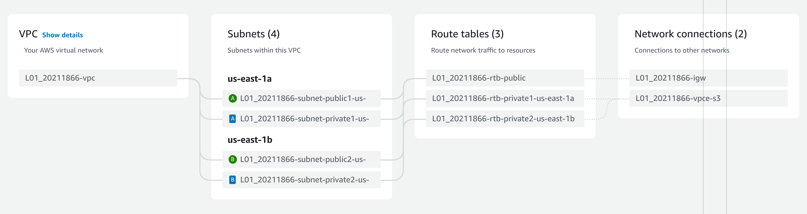

# Preliminary activities
## Creation of a virtual network infrastructure in AWS
### Creation of a VPC
Following the [video instructions](https://youtu.be/ApGz8tpNLgo), get this [[vpc_config.pdf|config setup]] on the VPC.

Here is the preview:



According to the VPC's route table private subnets have access to the internet.

![[public_rt.png]]
### Creation of two elastic IPs
Following this [video instructions](https://youtu.be/5ZJTESbN9lI), create the elastic IP addresses:

![[elastic_ips.png]]
## Creation of a GNU/Linux instance
Then create the [[ubuntu_config.pdf|instance]] and link the elastic IP address.

The command to `ssh` into an EC2 instance goes as follows:
```bash
ssh -i /path/to/key.pem user@instance-public-dns
```

Replace `path/to/key.pem` with the key file's path and `instance-public-dns` with your elastic IP address. Notice that `user` can vary depending on the AMI.
- **Amazon Linux**: `ec2-user`
- **Ubuntu**: `ubuntu`
- **CentOS**: `centos`
- **RHEL**: `ec2-user` or `root`
- **Debian**: `admin` or `root`

Finally, establish the `ssh` connection:

![[ubuntu.png]]

> [!Warning] to use the private key file it must be restricted to certain permissions. You might need to `chmod 400 key.pem`.


![[neofetch.png]]
## Creation of a Windows Server 2022 instance
Create the [[windows_config.pdf|instance]] and associate the elastic IP address.

To connect via RDP protocol, you can use `remmina` on [arch Linux](https://archlinux.org/):

![[remmina.png]]

Here is the connection being established:

![[windows.png]]

And here you can see the instance specs:

![[windows_specs.png]]

End of the preliminary tasks. The following activities are in the laboratory report [[L01.pdf]].

----
# References 
- [Access the AWS Academy platform](https://www.youtube.com/watch?v=iI4cG_fi6vg)
- [How to Create an AWS VPC with Public and Private Subnets](https://youtu.be/ApGz8tpNLgo)
- [How to Create and EC2 Instance in AWS in 2023](https://www.youtube.com/watch?v=MmHWh4p2Sqs)
- [How to create Elastic IP and attach with EC2 instance](https://youtu.be/5ZJTESbN9lI)
- [Network address translation - Wikipedia](https://en.wikipedia.org/wiki/Network_address_translation)
- [Visual private network - Wikipedia](https://en.wikipedia.org/wiki/Virtual_private_network)
- [What is a VPN? - kaspersky](https://www.kaspersky.com/resource-center/definitions/what-is-a-vpn)
